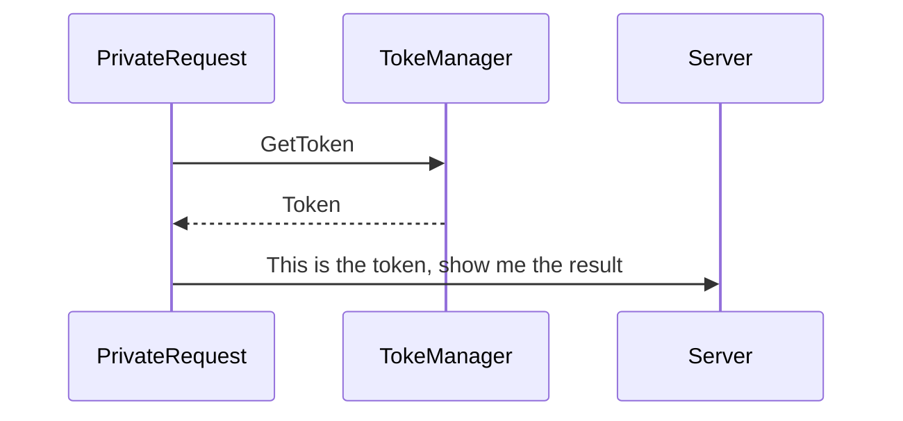
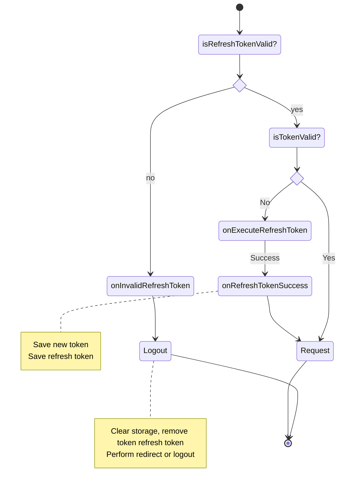

## Authorized Request Workflow


```mermaid
sequenceDiagram
    PrivateRequest->>TokeManager: GetToken
    TokeManager-->>PrivateRequest: Token
    PrivateRequest->>Server: This is the token, show me the result
```

```SnackPlayer name=@couldy/private-request-and-refresh-token

```

## Refreshing token workflow


```mermaid
stateDiagram-v2
    state isRefreshTokenValid <<choice>>
    state isTokenValid <<choice>>
    [*] --> isRefreshTokenValid?
    isRefreshTokenValid? --> isRefreshTokenValid

    isRefreshTokenValid --> onInvalidRefreshToken : no
    isRefreshTokenValid --> isTokenValid?: yes
    onInvalidRefreshToken --> Logout

    note Left of Logout
      Clear storage, remove token refresh token
      Perform redirect or logout
    end note

    isTokenValid? --> isTokenValid

    isTokenValid --> onExecuteRefreshToken: No
    onExecuteRefreshToken --> onRefreshTokenSuccess: Success

    onRefreshTokenSuccess --> Request

    note Right of onRefreshTokenSuccess
      Save new token
      Save refresh token
    end note

    isTokenValid --> Request: Yes

    Request --> [*]
    Logout --> [*]
```
